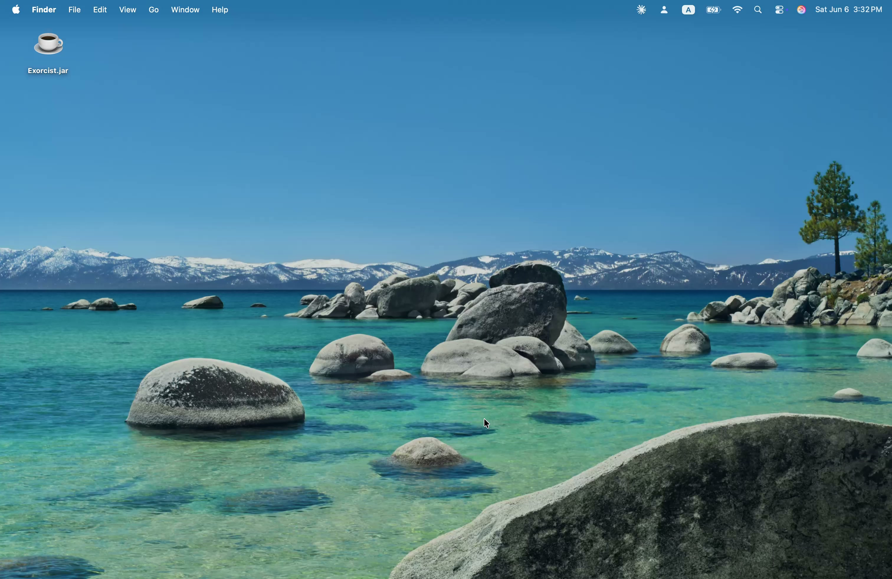

# Exorcist

A 2D infinite climbing platformer built in Java (Swing). Jump between procedurally generated platforms, fight enemies with a responsive combat system, and climb as high as you can.

[](https://youtu.be/cbCoB_rXNRQ)

## Features

- **Procedural generation** — platforms, hazards, and enemy placements are generated on the fly with increasing difficulty as you ascend
- **Four enemy types** with distinct AI behaviors: melee aggression, ranged cursing, aerial pursuit, and heavy tanking
- **Fluid combat** — attack, double jump, and a stamina-based shield that rewards timing
- **Persistent high score** saved between sessions
- **Polished animations** — per-entity sprite sheets with state-driven animation (idle, walk, attack, death)
- **Responsive game feel** — fall damage, knockback, curse DoT with visual feedback, half-heart regeneration

## Enemies

| Enemy | Behavior |
|-------|----------|
| **Wolf** | Fast and aggressive — lunges at the player on contact |
| **Golem** | Slow and tanky — heavy melee hits, high HP |
| **Witch** | Ranged — casts a stackable curse (DoT) and kites the player |
| **Bat** | Aerial — spawns periodically and pursues from any direction |

## Player

- Move, double jump, attack, and shield
- 5 hearts HP with 2 bonus overflow hearts (earned from kills)
- Shield with stamina bar — blocks frontal attacks, depletes on sustained use
- Half-heart regen every 20 seconds
- Fall damage for drops over 10 tiles

## Controls

| Key | Action |
|-----|--------|
| A / D or Arrow Keys | Move |
| W / Space / Up | Jump (double jump supported) |
| Z / J or Left Click | Attack |
| E / K or Right Click | Shield |
| Escape | Pause |

## Running

Requires Java 17+

```
java -jar Exorcist.jar
```

Download the latest release [here](https://github.com/TheYellowDuck/Exorcist/releases/latest).

## Built With

- Java 17, Swing (2D rendering)
- Procedural tile map with infinite upward scrolling
- State-machine enemy AI per entity
- Custom sprite animation system
- `javax.sound.sampled` for audio
